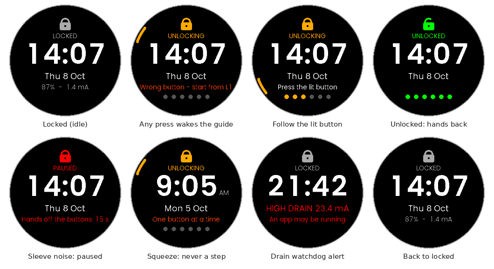

# una_experiment: riding in a jacket with a UNA Watch

A tight motorcycle-jacket cuff keeps pressing the [UNA Watch](https://unawatch.com)'s
buttons. Every so often, the presses start an activity, and the activity's GPS
drains the battery. This repository studies why, and tries a fix built on the
open [UNA SDK](https://github.com/UNAWatch/una-sdk).

**Read [`docs/STUDY.md`](docs/STUDY.md).** It covers the root cause in the SDK's
source, the options, the design, the evaluation, what is still unknown, and how to
try it on a watch.

## In short

- **Cause.** From the watch face, **R1 R1** opens the first activity. Opening it
  turns the GPS on, and the stock apps never give up waiting on their START screen.
  **R1 R1 R1 R1** starts a recording. The firmware owns the buttons on the watch
  face, so no app can stop those presses there.
- **Fix 1: [RideLock](apps/RideLock)**, a lock-screen app.
  - While locked it is in front of everything, so the presses go to it.
  - It unlocks only for **L1 R1 R2 L2 L1 R1**, with the next button lit on
    screen, plus rules a sleeve can't satisfy.
  - It relocks itself, comes up locked after a reboot, and warns if the battery
    drains behind it.
- **Fix 2: [a patch](patches) for the stock Run, Bike and Hike apps.**
  - Start needs a 1.5 s hold of R1 alone.
  - An activity opened and never started closes after 5 minutes.
- **Evidence.**
  - 71 unit tests.
  - A Monte Carlo jacket model: **0 false unlocks in 6,000 simulated hours**.
    The same noise opens an activity 2–5 times an hour on a stock watch.
  - PC-simulator runs of every screen and of the service across launches.
  - Builds for the watch.
  - Nothing has run on a real watch yet; [§8](docs/STUDY.md#8-what-is-not-known-yet-needs-the-real-watch)
    lists what that must confirm.



## Try it

Prebuilt `.uapp` files are in [`dist/`](dist), with checksums. To install,
copy `RideLock_0.1.0.uapp` into a new `Apps/RideLock/` folder over USB and
power-cycle the watch. Details, calibration and how to revert:
[`docs/STUDY.md` §7](docs/STUDY.md#7-trying-it-on-a-watch).

## Build and test

```bash
tools/bootstrap.sh        # UNA SDK @ b5749dc4, Arm GNU Toolchain 13.3.rel1, Python deps -> .deps/
source tools/env.sh
tools/build.sh            # dist/RideLock_0.1.0.uapp
tools/build.sh --activity # + patched Run, Bike, Hike
tools/test.sh             # host unit tests + jacket model (needs a C++17 compiler, CMake)
tools/test.sh --sim       # + PC simulator scripts and service harness (needs SDL2 dev, Ninja)
```

## Layout

| Path | |
|---|---|
| `docs/STUDY.md` | The study |
| `docs/jacket-report.md` | Full jacket-model results, including the ablation |
| `apps/RideLock/` | The lock-screen app (service + LVGL GUI + PC simulator) |
| `patches/` | The Run/Bike/Hike patch, its generator script and a draft upstream PR |
| `tests/` | Host unit tests and the jacket model |
| `tools/` | Bootstrap, build and test scripts |
| `dist/` | Prebuilt `.uapp` files |

## Licences

- This repository's code: MIT, like the UNA SDK it builds on.
- The fonts in `apps/RideLock/Software/Apps/LVGL-GUI/assets/fonts` are Poppins
  (SIL OFL 1.1), copied from the SDK.
- The patch modifies UNA's MIT-licensed example apps.
- "UNA" is a trademark of UNA Watch Ltd. This is an independent experiment.
