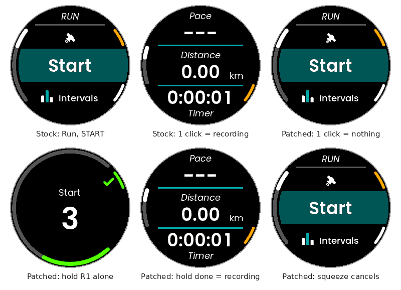

# Jacket cuffs vs. the UNA Watch: a study, and an experimental fix

**Problem.** A tight motorcycle-jacket cuff presses the UNA Watch's buttons. Often
enough, those presses start an activity, and the activity drains the battery.

**Short answer.**

- **Why it happens.** Opening an activity takes two presses of the top-right
  button from the watch face. Opening it turns the GPS on, and nothing turns it off
  again until START is pressed or the app is left. A third and fourth press start
  recording.
- **What can't be fixed from an app.** On the watch face the buttons belong to the
  closed-source firmware, so no app can block them there.
- **What an app can do.** It can stay in front of the watch face and take every
  button press itself, which is a lock screen.
- **What I built.**
  - **RideLock**, a lock-screen app. It shows the time, date and battery, ignores
    all presses until a deliberate six-step sequence is entered, relocks by
    itself, comes up locked after a reboot, and warns if the battery is draining
    behind it.
  - **A patch for the stock Run, Bike and Hike apps.** START needs a 1.5 s hold,
    and an activity opened but never started closes itself after 5 minutes.
- **How it was checked.** Unit tests, a Monte Carlo model of a cuff pressing
  buttons, and the SDK's PC simulators. Over 6,000 simulated hours of hostile
  cuff noise, RideLock unlocked by accident **zero** times. The same noise opens
  an activity about **2–5 times an hour** on a stock watch.
- **Not yet done.** Nothing has run on a real watch, and §8 lists what that
  still needs to confirm.

Everything below refers to [UNAWatch/una-sdk](https://github.com/UNAWatch/una-sdk) at
commit `b5749dc4` (8 Oct 2026), the version this work was built and tested against.

---

## 1. The situation

- The watch is worn under a tight leather cuff. Wrist movement (clutch, throttle,
  bumps) makes the cuff press the buttons.
- The presses are not seen. The first sign is a flat battery, or an activity
  found running long after the ride.
- What is needed is a watch that can be ridden with, without managing it
  constantly, and that still works as a watch afterwards.

## 2. The UNA ecosystem, as far as it matters here

### Hardware

UNA is a modular, repairable GPS sports watch. It has a 1.2" round 240×240
memory-in-pixel display with a backlight, an STM32 MCU, a dual-frequency GNSS, an
optical HR sensor, an IMU, a barometer and BLE. The battery is a user-replaceable
280 mAh cell. UNA quotes up to 10 days of everyday use and 20 hours in GPS mode
([product listing](https://heyupnow.com/products/una-the-worlds-first-modular-gps-sports-watch),
[Notebookcheck](https://www.notebookcheck.net/UNA-Watch-Repairable-Garmin-alternative-launches-with-10-day-battery-life-and-MIP-display.1353765.0.html)).
That is roughly **1.2 mA average in everyday use against about 14 mA with GPS**.
An activity left running by accident drains the battery about **12 times faster**.

There is **no touchscreen**: four buttons do everything.

| Button | Position | Role (official quick-start guide) |
|---|---|---|
| L1 | top left | up; from the watch face: utilities |
| L2 | bottom left | down; from the watch face: glances |
| R1 | top right | **select / confirm / start / stop**; long press powers on |
| R2 | bottom right | back / lap |

The hardware design files are published under CC BY 4.0
([UNAWatch/una-hardware](https://github.com/UNAWatch/una-hardware)).

### What is open, and what is not

| Part | Open? | Where |
|---|---|---|
| SDK: headers, libraries, build scripts, simulators | Yes, MIT | `una-sdk` |
| **All the stock apps**: Run, Bike, Hike, Treadmill, Workout, Alarm, Timer, Stopwatch, glances, watch faces | Yes, MIT | `una-sdk/Examples/Apps` |
| **The kernel**: home screen, launcher menus, settings, notifications, power | **No** | not published |

Because the stock apps are open, the activity apps' behaviour can be read, and can
be changed. The kernel's menus cannot be changed.

### How apps work (SDK, `Docs/service-lifecycle.md`, `Docs/architecture-deep-dive.md`)

- **Two processes.** Each `.uapp` is two native ARM processes: a **service** (logic,
  sensors, files) and a **GUI** (drawing, buttons). They talk through typed messages
  in kernel memory pools.
- **Buttons go only to the GUI on screen.** The kernel sends `EVENT_BUTTON`:
  `PRESS` when a button goes down, and on release `CLICK` (only if held less than
  500 ms) followed by `RELEASE`.
- **On the watch face, the kernel owns the buttons.**
  `Docs/writing-a-clockface.md`: *"The kernel owns the buttons while a face is on
  screen: pressing one opens the top menu or the glance list, it does not reach
  your app."* No app, not even a watch face, can intercept the presses that open
  the activity menu.
- **Leaving an app does not stop it.** Navigating away *suspends* the GUI. The
  service, and every sensor it subscribed to, keeps running.
  `Docs/service-lifecycle.md`: *"A resident service holding a GPS or heart-rate
  subscription keeps that sensor powered and duty-cycled with nothing on screen."*
- **An app can autostart at boot** (`APP_AUTOSTART`). Its service can then put its
  own GUI **in front of whatever is on screen** with `RequestAppRunGui`. The SDK's
  Alarm app does this. This is the mechanism a lock screen needs.
- **Apps can read the fuel gauge**, including battery current
  (`SDK::Sensor::Type::BATTERY_METRICS`). An app can therefore notice a drain it
  did not cause.
- **Phone-editable settings.** Apps can declare configuration fields that the
  companion phone app edits (`Docs/app-config-fields.md`). The watch never needs a
  four-button settings editor.

## 3. Root cause: what a cuff actually does

I traced the path in the source of the stock **Run** app
(`Examples/Apps/Running`). Bike (`Cycling`) and Hike (`Hiking`) share the same code
on every point below.

```
watch face ──R1──► activity list ──R1──► Run opens ──R1 on START──► recording
                                            │                     (with a GPS fix;
                                            │   GPS searching      without one: a
                                            │   from this moment   confirm screen
                                            ▼                      where R1 starts it)
                                   idle timeout never fires
                                   while START is selected
```

1. **R1 opens the activity list, and R1 again opens the first activity.** That is
   two presses of the button nearest the hand.
2. **Opening the activity turns the GNSS on immediately.** This pre-warms a fix
   for START. In `Software/Libs/Sources/Service.cpp`, `Service::onStartGUI()` does
   `mGpsWanted = true; connectGps();` and also `requestAccessoryPrepare()`, which
   scans for an external HR strap over BLE.
3. **Nothing ever gives up waiting.** The pre-activity screen has a 30 s idle
   timeout, but `MainPresenter::onIdleTimeout()` only acts when the cursor is
   *not* on START:

   ```cpp
   void MainPresenter::onIdleTimeout()
   {
       if (view.getPositionId() != App::MenuNav::Root::ID_START) {
           model->exitApp();
       }
   }
   ```

   START is the default item. An activity opened by a sleeve therefore searches
   for satellites until the battery is flat.
4. **Starting is a single click; stopping is not.** `MainView::onConfirm()` starts
   the recording on an R1 *click* when there is a fix. Without a fix it goes to a
   confirm screen where another R1 click starts it. Ending a recording, by
   contrast, needs R1 *held* through a 1.5 s countdown
   (`TrackHoldConfirmationView`). The design protects runners from stopping by
   accident. Nothing protects against starting by accident.
5. **Moving away does not help.** Whatever else the sleeve does, a suspended
   activity keeps its GPS subscription (§2).

I reproduced the app side (steps 2–4) in the SDK's own PC simulator of the stock
Run app. The launcher (step 1) belongs to the closed kernel and is not simulated.

- Opening Run starts the GPS.
- Left on START for 45 s, the app neither times out nor releases the GPS. With
  the cursor moved to Intervals instead, it exits after its 30 s timeout.
- One R1 click on START starts the recording
  (`docs/images/activity-patch.png`, first two frames), and the log shows GPS,
  HR, barometer and IMU all starting.

So the drain comes from **three presses of R1**, which leave the GPS searching.
**Four presses** start a recording.

## 4. Solution space

| # | Option | Effort | Fixes | Downsides |
|---|---|---|---|---|
| A | Wear it differently: other wrist, higher on the forearm, over the cuff, or in a pocket | none | sometimes | Loses the watch; a tight cuff may still reach it |
| B | Power the watch off before riding | none | mostly | A long press of R1 powers it back on, and a cuff can do that |
| C | A 3D-printed button guard (the case is CC BY 4.0) | printer | most presses | Also blocks deliberate presses; fit unknown |
| D | **A button lock in the firmware** (e.g. hold two buttons) | UNA only | completely | The kernel is closed: needs UNA. A request is drafted in §9 |
| E | **A lock-screen app**: stay in front, take every press, unlock only with a deliberate sequence | app | yes, while locked | Must be engaged, so it is built to engage itself |
| F | **Fix the activity apps**: start needs a hold; give up if never started | small patch | most of the damage | Single-button holds still start one; replaces stock apps |
| G | **Drain watchdog**: watch the battery current and alert | app | detection only | Thresholds need calibrating on real hardware |

D is the proper fix, but it is not ours to make. **E, F and G can be built today,
and they complement each other.** The experiment builds all three: E and G in one
app (RideLock), and F as a patch to the stock apps.

## 5. The experiment

### 5.1 RideLock (`apps/RideLock`)

A Utility app (service plus LVGL GUI) built with `APP_AUTOSTART`.

**While locked**, its GUI is in front of everything. The buttons therefore reach
RideLock, never the launcher or an activity. The screen works as a watch face:
padlock, time, date, battery and (optionally) the measured current. It redraws
only when something changes.


**Unlocking** follows the lit button: **L1 R1 R2 L2 L1 R1**, one and a half laps of
the case clockwise from the top left. The first press wakes the guide: an amber
arc beside the next button, and dots for progress. The sequence never has to be
remembered. The rules that keep a sleeve out live in
`Software/Libs/Core/RideLock/UnlockDetector.*`:

| Rule | What it stops |
|---|---|
| **Both sides, no repeats** (enforced on any configured sequence) | A cuff pressing one side; one bouncing button |
| **One button at a time**: any chord ends the attempt | Squeezing the case |
| **Quiet first**: the first step only counts after 0.6 s without input | A burst that happens to start with the right button |
| **Brisk**: each press under 1.2 s, next step within 2.5 s | Holds, slow random presses |
| **Exact order**: a wrong button ends the attempt and cannot restart it | Random sequences |
| **Cool-down**: 3 rejected attempts within 30 s pause unlocking until 15 s of silence | Sustained noise. A person fumbles once or twice; a sleeve fails continuously |
| **Pinned buttons ignored** after 4 s | A cuff pinning a button cannot lock the wearer out |

**Engaging** is automatic (`LockController.*`):

- **Boot**: the service starts with the watch and puts the lock up after a 5 s
  grace. A reboot, or a power-on in a sleeve, comes up locked.
- **Relock**: after an unlock the service stays resident with nothing subscribed,
  and puts the lock back up after `relockMinutes` (default 2).
- **Opened by hand** from Utilities: locks at once.
- **Lost or hidden**: if the lock screen is killed, it is relaunched at most once
  per period. If it stays behind another screen (an alarm, or any kernel gesture a
  sleeve might find), it is brought back to the front after the relock period.

**While locked, RideLock also:**

- turns off the kernel's L2-hold music control (a hold is what a cuff does);
- keeps phone notifications on (configurable).

**The drain watchdog** (`DrainWatchdog.*`) samples the fuel gauge's current every
30 s, but only while locked. It averages over a 10-minute window, ignoring the
gauge's sign. If the average stays at or above **8 mA** (about 7× idle, about 0.6×
GPS mode), the watch vibrates and lights up, and the date line becomes **HIGH
DRAIN**. This catches an activity that was opened *before* the lock went up and is
still running behind it. Charging suspends the watchdog. The current is shown on
the lock screen so the threshold can be calibrated (§7).

**Settings**, declared in `Output/app-manifest.json` and editable from the phone
or as `app_config.json` over USB:

| Setting | Default |
|---|---|
| `unlockSequence` | `L1 R1 R2 L2 L1 R1` |
| `relockMinutes` (0 = off) | 2 |
| `lockAtBoot` | true |
| `notificationsWhileLocked` | true |
| `drainAlertMilliamps` (0 = off) | 8 |
| `drainWindowMinutes` | 10 |
| `showCurrent` | true |

**Cost.** While locked, the GUI is the foreground app, so it receives the kernel's
10 Hz frame ticks like any watch face. It draws nothing between minutes. The
service wakes once a minute, plus one gauge reading every 30 s. This should be in
the same range as a watch face, but it has **not been measured** (§8).

### 5.2 Patch to Run, Bike and Hike (`patches/`)

`make_activity_patch.py` applies it to an SDK checkout, and `activity-apps.patch`
is its output. It makes two changes to each app:

1. **Hold to start, alone.** START now needs **R1 held through the existing 1.5 s
   countdown screen**, which gains a Start mode: green, labelled "Start". Releasing
   early returns to the menu. If another button is down when the hold begins, or
   goes down during it (the case squeezed), the hold is cancelled.
2. **Pre-activity budget.** If no activity has started **5 minutes** after opening,
   the service closes the app. That turns off the GNSS and the strap scan. The
   pre-activity screens hold nothing unsaved.



## 6. Evaluation

### 6.1 Tests

| What | How | Result |
|---|---|---|
| Unlock rules, lock policy, watchdog | 71 GoogleTest cases (`tests/`) | all pass |
| Cuff noise (§6.2) | Monte Carlo, frame-paced exactly like the LVGL port | 0 false unlocks in 6,000 h |
| Lock screen, all states | PC simulator (`simulator/scripts/*.txt`) with scripted kernel events and screenshots | 4/4 scripts pass |
| Service across launches: boot lock, relock after 1 min, manual open, re-assert when hidden | `RideLockServiceHarness` on the SDK's mock kernel, real time | 4/4 scenarios pass; timings within 10 ms |
| Watch builds | Arm GNU Toolchain 13.3.rel1 + the SDK's packer | `.uapp` for RideLock, Run, Bike, Hike |
| Patched Run: click / hold / early release / squeeze during / squeeze before | SDK's TouchGFX simulator, keys sent under Xvfb | only the uninterrupted hold of R1 alone starts |
| Patched Run: 5-min budget | same simulator, budget shortened to 20 s | "No activity started within 20 s of opening: closing"; GPS stopped |
| Manifest ↔ field table | the SDK's `validate_app_config.py` | OK; minimum kernel 1.4.0 (ABI 3) |

### 6.2 The jacket model (`tests/JacketModel.hpp`, `docs/jacket-report.md`)

Nobody has a recording of what a leather cuff does to a watch, so I modelled six
deliberately hostile kinds of noise. Each simulated ride is an hour long:

- random taps on any button, every ~6 s on average;
- one-sided rubbing with 20% holds;
- road bumps: bursts of 2–6 taps;
- squeezes of 2–4 buttons at once;
- a pinned button plus random taps;
- chaos: taps, holds and chords every ~1.5 s.

The noise becomes the kernel's event stream and is fed to two things:

- RideLock, one code per 10 Hz frame through the port's 16-deep queue (as the
  real `GuiCommandProcessor` does);
- a model of the stock menus and Run app. Its rules come from §3; menu timeouts
  and time to fix are assumptions.

1,000 rides per model:

| Jacket model | Stock: activities opened /h | Stock: recordings /h | Stock: GPS on | Patched apps: recordings /h | Patched apps: GPS on | RideLock: false unlocks |
|---|---:|---:|---:|---:|---:|---:|
| Random taps | 4.8 | 0.96 | 72 % | 0.00 | 14 % | 0 in 1000 h |
| One-sided rubbing | 1.4 | 0.49 | 48 % | 0.49 | 44 % | 0 in 1000 h |
| Road bumps | 2.2 | 1.00 | 93 % | 0.00 | 21 % | 0 in 1000 h |
| Squeezes | 1.8 | 0.25 | 16 % | 0.00 | 4 % | 0 in 1000 h |
| Pinned + taps | 3.7 | 0.94 | 73 % | 0.00 | 17 % | 0 in 1000 h |
| Chaos | 5.3 | 1.00 | 87 % | 0.44 | 34 % | 0 in 1000 h |

The full table with the per-rule ablation is in `docs/jacket-report.md`;
regenerate it with `build-tests/jacket_report 1000`.

What the numbers say:

- **The rules matter more than the length.** The same six steps with none of the
  rules (a naive lock) fails up to 266 times per 1,000 h (127 under random taps).
  With the rules, it fails none.
- **Length and the cool-down matter most.**
  - With 5 steps: up to 3 false unlocks per 1,000 h. With 4: up to 19.
  - At 4 steps, every rule shows its value. Removing the cool-down takes chaos
    from 0 to 192. Removing the quiet rule takes bumps from 15 to 32. Removing
    the chord rule takes pinned + taps from 3 to 5, and chaos from 0 to 2.
  - At the 6-step default, only removing the cool-down let anything through
    (1–2 per 1,000 h).
- **The default is very robust.** In a separate 10,000 h-per-model run, the
  default made 3 false unlocks under random taps and 2 under bumps, and none
  under the other four models. That is about one per 3,000–5,000 hours of the
  most hostile noise. One-sided noise, which is what a cuff most plausibly makes,
  never got through.
- **The patch alone is not enough.** It removes taps, bumps and squeezes as
  causes. But a single-button hold, which a cuff can produce, still completes a
  hold-to-start, so under one-sided rubbing it barely helps. That is why RideLock
  is the primary fix and the patch a second layer.

## 7. Trying it on a watch

Prebuilt files are in `dist/` (see `dist/SHA256SUMS`), or build them with
`tools/bootstrap.sh && source tools/env.sh && tools/build.sh --activity`. The apps
need firmware with kernel **1.4.0 or newer** (SDK ABI 3).

**RideLock only (recommended first).**

1. Connect the watch by USB and wait for its drive.
2. In `Apps/`, create a folder `RideLock` and copy `RideLock_0.1.0.uapp` into it.
   (UNA's docs use the app name; one third-party guide uses the APP_ID
   `5CBC53B94083EF7D`. If the app does not appear, try that.)
3. Optional: copy `apps/RideLock/Output/app_config.example.json` to the same
   folder as `app_config.json` and edit it.
4. Eject safely, then power-cycle the watch. It should come up locked about 5 s
   after booting.

**Calibrating the drain alert.**

1. While locked, the status line shows the averaged current once a few samples are
   in. Note it at rest.
2. Unlock, open Run (now with a hold), and wait on its START screen with GPS
   searching.
3. Lock again and note the current after a few minutes.
4. Set `drainAlertMilliamps` about halfway between the two readings.

**The patched Run/Bike/Hike (optional).** Over USB, find the folder holding the
stock `Running_*.uapp` (and `Cycling`/`Hiking`). **Move the original to your
computer as a backup** and put the `_1.5.0-ridelock` file in its place. The phone
app may later "update" it back to the stock version. To revert, restore the
backup.

## 8. What is not known yet (needs the real watch)

Everything was built and tested against the open SDK and its simulators. These
points depend on the closed kernel or the hardware:

1. **Does `RequestAppRunGui` really bring RideLock in front of an app that is in
   front?** The SDK documents it ("whichever app was on screen is suspended") and
   the Alarm app relies on it, but I could not observe it.
2. **Are there kernel-level button gestures inside apps?** For example, a long
   press that returns to the watch face, or a power-off hold. The L2-hold music
   control is the only documented one, and RideLock turns it off. Any other would
   suspend the lock, and RideLock re-asserts it after the relock period.
3. **What do buttons do on a notification popup over the lock?** If that worries
   you, set `notificationsWhileLocked` to false.
4. **`BATTERY_METRICS` on real hardware**: its availability to third-party apps,
   the sign and units of `AVERAGE_CURRENT`, and its update rate. The activity apps
   subscribe to it, which suggests it is available. The watchdog uses the
   magnitude, and the screen shows it, to check.
5. **Real power cost** of RideLock while locked (ticks, the minute redraw, the
   gauge reading), compared with the stock watch face.
6. **Whether the kernel lights the backlight on every button press.** A cuff
   pressing all ride long would then also cost backlight. Measurable with the
   current readout.
7. **The `Apps/` folder naming** for sideloaded apps, and whether the companion
   app overwrites patched stock apps.

## 9. Recommendations

1. **Today:** install RideLock, keep the defaults, ride, and look at the current
   readout and the drain alert. If the six-step unlock is too slow, try
   `L1 R1 R2 L2 L1`: 5 steps, about 1–3 false unlocks per 1,000 h of the worst
   modelled noise.
2. **Optionally:** install the patched Run/Bike/Hike as a second layer.
3. **Ask UNA** for a firmware button lock. Draft, for
   [una-sdk issues](https://github.com/UNAWatch/una-sdk/issues):

   > **Feature request: button lock in the kernel.** With no touchscreen, all
   > input is four buttons, and on the watch face they belong to the kernel. Apps
   > cannot protect them. In a tight sleeve (motorcycle jacket, wetsuit, ski
   > jacket) presses happen on their own: R1 R1 opens an activity, whose GNSS then
   > searches indefinitely (`MainPresenter::onIdleTimeout` never exits on START),
   > and R1 R1 R1 R1 starts a recording. Please add a kernel button lock (e.g.
   > hold L1+R2 to lock, the same to unlock, with a padlock on the watch face),
   > optionally automatic after N minutes of inactivity. A third-party app can
   > approximate this (github.com/frdescam/una_experiment), but only the kernel
   > can lock the watch face itself.

4. **Upstream the activity-app fix.** `patches/README.md` has a PR description
   ready. The pre-activity budget is uncontroversial. Hold-to-start changes the
   stock UX and is worth discussing with UNA first.
